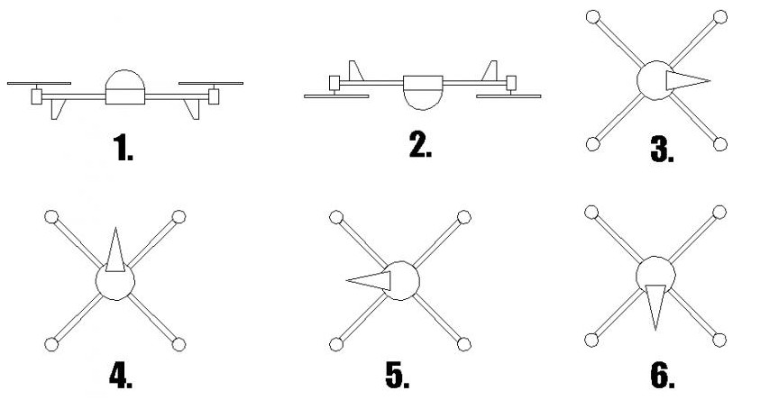

Accelerometer calibration is mandatory if inertial position estimation is used. Modern accelerometer sensors are accurate, but they require calibration if we want precise measurements. Sensors might be biased, gains on different axis might be different. Advanced 6-point calibration takes care of all irregularities sensor might have.

Use this video as guidance [LINK  YOUTUBE](https://www.youtube.com/watch?v=HxWSn_noNgg)

## Accelerometer calibration steps
Please note that, unlike cleanflight, iNav does not do a level calibration in accelerometer calibration! See "Level calibration" below.

Note: If the flightcontroller is mounted in another angle or upside down, do the calibration steps with the flightcontroller pointing as shown in the pictures, not the quad (otherwise calibration won´t work).

0. Connect the copter to the "Configurator" software, select the "Setup" tab.
1. Place copter level (pos 1) and press "Calibrate Accelerometer" button. Advanced calibration has been activated and recorded the 1-st data point.
2. Place copter on all sides in sequence (pos 2-6): on its back, right side, nose up, left side, nose down. Press "Calibrate Accelerometer" button for in every position. The advanced calibration algorithm will record 2-nd to 6-th data points.
3. After all 6 positions have been recorded advanced calibration will calculate offsets and gains and store them in EEPROM. Accelerometer calibration done.
4. Use CLI to verify that **accgain_x**, **accgain_y** and **accgain_z** parameters are **NOT 4096**. If they are, algorithm failed to converge, calibration failed and needs to be repeated.

There is no need to place copter perfectly aligned, the algorithm does not care about exact positions as long as they are close to 90 degree apart and copter is stationary in every position.

## Level calibration

Proper accelerometer calibration does not guarantee copter being level. Chip might be misaligned on board or the board itself might be mounted at some tiny angle. For level flight and navigation features to work you need to trim the firmware to level flight using "Board Alignment" on the "Configuration" tab. 

**NOTE!** If using CLI to set up board alignment unlike in Cleanflight firmware board alignment angles are set in degrees*10, so if you need to trim your board 1.5 degrees you should enter "15".

## Compass calibration
### Performing the calibration

Calibrate with flight battery powering up the aircraft. 

Press "Calibrate Magnetometer" button. You have 30 seconds to hold the copter in the air and rotate it so that each side (front, back, left, right, top and bottom) points down towards the earth. However the algorithm is smart enough to calculate the proper calibration values even if you simply wave the copter in the air for 30 seconds after pressing "Calibrate Magnetometer" button.

### Verifying that compass is calibrated properly
Connect the copter to Cleanflight Configurator and observe the attitude values on the "Setup" screen (values of Heading, Pitch and Roll). Point your copter's nose North and verify that heading is reading 0 deg. Tilt the copter 30 degrees forward, right, left and back while observing the Heading value. Value of 0 deg shouldn't change more than several degrees. Repeat the process with copter's nose pointing East (heading=90 deg), South (heading=180 deg), West (heading=270 deg).

If the value is incorrect when copter is level, you likely don't have **align_mag** CLI variable set to proper compass alignment value. If heading value is correct when copter is level but drifts when you tilt the copter, then your should re-calibrate the compass.

Also, remember to set magnetic declination to a proper value on the "Configuration" screen.
The magnetic declination of your specific location can be found here: www.magnetic-declination.com

If your magnetic declination readings are e.g. +3° 34' , the value entered in the iNav configurator is 3.34 (3,34 in some locales). In the CLI, the same effect would be `set mag_declination = 334`. For west declination, use a minus value, e.g. for 1° 32' W, `set mag_declination = -132`. In all cases (both CLI and GUI), the least significant digits are **minutes**, not decimal degrees.

In iNav 1.2, on non-F1 targets, one can use an automatic declination setting, which is more than accurate enough for iNav. `set inav_auto_mag_decl = ON`.

## Backup and restore the settings

To avoid going through full calibration after resetting the configuration new CLI settings are introduced to get and set accelerometer offsets and gains: **acczero_x**, **acczero_y**, **acczero_z**, **accgain_x**, **accgain_y**, **accgain_z**.
