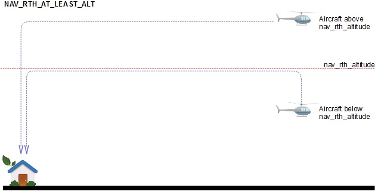

This page will list and explain all the different navigational flight modes that iNav has.

- When enabling the navigation modes in the modes tab, they don´t light up green until you have a valid 3D GPS fix.    
- INAV activates its specific modes only when armed.  

Lets have a look at each mode of operation in detail.

## ALTHOLD - Altitude hold
Recomended to use with angle, horizon or poshold mode.
Throttle input indicate climb or sink at a predetermined maximum rate.

// TODO: explain relevant settings

Activated by **ALTHOLD** flight mode.

## POSHOLD - Horizontal position hold
Please note that you have to use this with **ALTHOLD** to get a full 3D position hold!
You can use your roll and pitch stick to move around. The position hold will be resumed when you center the roll/pitch stick again.

// TODO: explain relevant settings

Activated by **POSHOLD** flight mode.

## HEADING LOCK
This flight mode affects on yaw axis and can be enabled together with any other flight mode. 
It helps to maintain current heading without pilots input and  magnetometer's support. When yaw stick is neutral position, Heading Lock tries to keep total amount on rotation on yaw at zero. When pilot moves yaw stick, Heading Lock is not used.
It is a equivalent of [TauLabs Axis Lock mode](https://github.com/TauLabs/TauLabs/wiki/Flightmode-Settings#axislock)

## RTH - Return to home
RTH will attempt to bring copter/plane to launch position. Launch position is defined as a point where aircraft was ARMed. RTH Will control both position and altitude. You will have to manually control altitude if your aircraft does not have an altitude sensor (barometer).

// TODO: explain how this works with planes.
// TODO: explain relevant settings

There are many different modes for Altitude, see [further down on this page](https://github.com/iNavFlight/inav/wiki/7.-Navigation-modes#rth-altitude-control-modes)

Activated by **RTH** flight mode.

## WP - Autonomous waypoint mission
This mode is a work in progress.

// TODO: Explain better

## GCS_NAV - Ground control station
This mode is a work in progress. Used for follow-me etc.

// TODO: Explain better
 
## Mode switch diagram

A diagram to indicate flight modes relation to navigation modes and illustrate sensor requirements:

# RTH Altitude control modes

RTH sequence can control altitude in several different ways, controlled by **nav_rth_alt_mode** and **nav_rth_altitude** parameters.

Default setting is NAV_RTH_AT_LEAST_ALT - climb to preconfigured altitude if below, stay at current altitude if above.

## Maintain current altitude (NAV_RTH_NO_ALT)
nav_rth_alt_mode = CURRENT

nav_rth_altitude is ignored

## Maintain current altitude + predefined safety margin (NAX_RTH_EXTRA_ALT)
nav_rth_alt_mode = EXTRA

nav_rth_altitude defines extra altitude margin

## Predefined altitude (NAV_RTH_CONST_ALT)
nav_rth_alt_mode = FIXED

nav_rth_altitude defines exact RTH altitude above launch point.

If the quadcopter is below nav_rth_altitude it will enter position hold and climb to desired altitude prior to flying back home. If the machine is above the desired altitude, it will turn and fly home and descend on the way.

## Maximum altitude since launch (NAV_RTH_MAX_ALT)
nav_rth_alt_mode = MAX

nav_rth_altitude is ignored

## At least predefined altitude above launch point (NAV_RTH_AT_LEAST_ALT)
nav_rth_alt_mode = AT_LEAST

nav_rth_altitude defines exact RTH altitude above launch point

