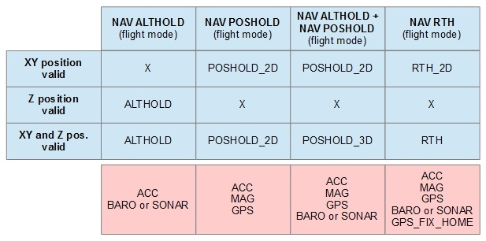
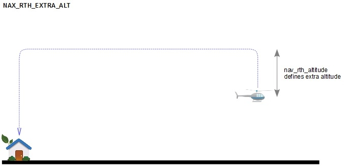
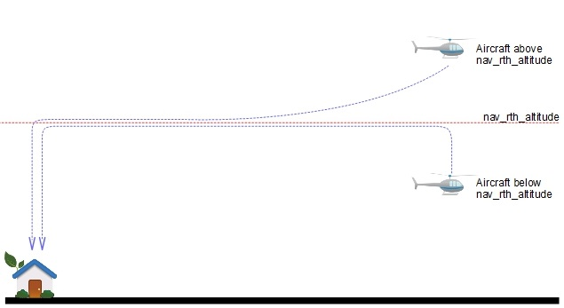

This page will list and explain all the different navigational flight modes that iNav has.

- When enabling the navigation modes in the modes tab, they don´t light up green until you have a valid 3D GPS fix.    
- INAV activates its specific modes only when armed.  
- Flightmodes like poshold, althold, RTH is self contained and doesn't need any additional modes like angle mode activated.

Note: All iNAV parameters for distance, velocity, and acceleration are input in  cm, cm/s and cm/s^2. 

Lets have a look at each mode of operation in detail.

## ALTHOLD - Altitude hold
When activated, the aircraft maintains its actual altitude unless changed by manual throttle input.
Throttle input indicate climb or sink at a predetermined maximum rate (see CLI variables). A barometer in your FC is needed (not for a plane with GPS).

// TODO: explain relevant settings

Activated by **ALTHOLD** flight mode.

## POSHOLD - Horizontal position hold
When activated, the quad/plane keeps its horizontal (2D) position, throttle still controls up and down movements (z-axis).
You can use your roll and pitch stick to move around. The position hold will be resumed when you center the roll/pitch stick again.      
Please note that you have to use this with **ALTHOLD** to get a full 3D position hold!  

// TODO: explain relevant settings.
// TODO: explain what happens when you are in POSHOLD mode and GPS fails.

Activated by **POSHOLD** flight mode.

## HEADING LOCK
This flight mode affects on yaw axis and can be enabled together with any other flight mode. 
It helps to maintain current heading without pilots input and  magnetometer's support. When yaw stick is neutral position, Heading Lock tries to keep total amount on rotation on yaw at zero. When pilot moves yaw stick, Heading Lock is not used.
It is a equivalent of [TauLabs Axis Lock mode](https://github.com/TauLabs/TauLabs/wiki/Flightmode-Settings#axislock) // TODO: explain if this works for FW w/o magnetometer.

## RTH - Return to home
RTH will attempt to bring copter/plane to launch position. Launch position is defined as a point where aircraft was ARMed. RTH Will control both position and altitude. You will have to manually control altitude if your aircraft does not have an altitude sensor (barometer). In the case of fixed wing, altitude comes from the GPS, so you dont need a barometer in your FC (CC3D for example).

With default settings RTH will land immediately if you are close than 5 meters from launch position. If further away it will make sure to have at least 10 meters of altitude, then start going home at 3m/s, and land. It will disarm itself if so configured, otherwise you will have to manually disarm once on the ground.

// TODO: explain how this works with planes.
// TODO: explain relevant settings.
// TODO: explain what happens when you are in RTH mode and GPS fails.

There are many different modes for Altitude, see [further down on this page](https://github.com/iNavFlight/inav/wiki/7.-Navigation-modes#rth-altitude-control-modes)

Activated by **RTH** flight mode.

## WP - Autonomous waypoint mission
Autonomous waypoints are used to let the quad/plane autonomous fly a predefined mission. The mission is defined with waypoints, which have the information about latitude, longitude, height and speed between the waypoints. GUIs such as EZ-GUI and mwp can be used to set the waypoints and upload the mission. Cleanflight or iNav configurator are still not capable of creating waypoint missions.  
Uploaded missions are saved in the FC until a reboot or a new uploaded mission erases the old one.  
  
Once the waypoint mode is activated (NAV WP has to be set previously in the mode tabs to a specific switch/value), the quad/plane will start to fly the waypoint mission based upon the waypoints in numerical order. Waypoint missions can be restarted by switching NAV WP off/on, interruption during the mission is also possible with switching NAV WP off. 

Currently up to 15 waypoints can be set.

This mode is a work in progress, it does however work well. There is an additional [[wiki page further describing way point missions, tools and telemetry options|iNavFlight Missions]].

// TODO: Explain better.
// TODO: explain what happens when you are in WP mode and GPS fails.

## GCS_NAV - Ground control station
This mode is a work in progress. Used for follow-me etc.

// TODO: Explain better.
// TODO: explain what happens when you are in GSC NAV mode and GPS fails.
 
## Mode switch diagram

A diagram to indicate flight modes relation to navigation modes and illustrate sensor requirements:

# RTH Altitude control modes

RTH sequence can control altitude in several different ways, controlled by **nav_rth_alt_mode** and **nav_rth_altitude** parameters.

Default setting is NAV_RTH_AT_LEAST_ALT - climb to preconfigured altitude if below, stay at current altitude if above.

## Maintain current altitude (NAV_RTH_NO_ALT)
nav_rth_alt_mode = CURRENT

nav_rth_altitude is ignored

## Maintain current altitude + predefined safety margin (NAX_RTH_EXTRA_ALT)
nav_rth_alt_mode = EXTRA

nav_rth_altitude defines extra altitude margin

## Predefined altitude (NAV_RTH_CONST_ALT)
nav_rth_alt_mode = FIXED

nav_rth_altitude defines exact RTH altitude above launch point.

If the multi-rotor is below nav_rth_altitude it will enter position hold and climb to desired altitude prior to flying back home. If the machine is above the desired altitude, it will turn and fly home and descend on the way.

## Maximum altitude since launch (NAV_RTH_MAX_ALT)
nav_rth_alt_mode = MAX

nav_rth_altitude is ignored

## At least predefined altitude above launch point (NAV_RTH_AT_LEAST_ALT)
nav_rth_alt_mode = AT_LEAST

nav_rth_altitude defines exact RTH altitude above launch point

