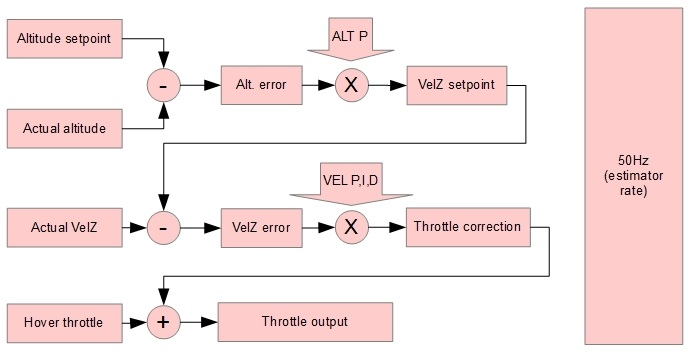

## PID regulators in ALTHOLD mode (Z-controller)

ALTHOLD mode uses two PIDs - **ALT** and **VEL**. Navigation Z-controller functional diagram is shown below:

### ALT PID
Actually ALT PID parameters control two P-controllers: Position-to-Velocity and Velocity-to-Acceleration

* **ALT_P** - defines how fast quad will attempt to compensate for altitude error, converts altitude error to desired vertical velocity (climb rate)
* **ALT_I** - not used
* **ALT_D** - not used

### VEL PID
This PID-controller is an Acceleration-to-Throttle controller

* **VEL_P** - defined how much throttle quad will add/reduce to achieve desired velocity
* **VEL_I** - controls compensation for hover throttle (and vertical air movement, thermals). This can be zero if hover throttle is precisely 1500us. Too much VEL I will lead to vertical oscillations, too low VEL I will cause drops or jumps when ALTHOLD is enabled, very low VEL I can result in total inability to maintain altitude
* **VEL_D** - acts as a dampener for acceleration. VEL D will resist any velocity change regardless of its nature (requested by VEL P and VEL I or induced by wind).

## PID regulators in POSHOLD/RTH/WP modes (XY-controller)

XY-controller uses two PIDs - **POS** and **POSR**

### POS PID
This is a Position-to-Velocity P-controller active in POSHOLD, RTH and WP modes

* **POS_P** - translates position error to desired velocity to reach the target
* **POS_I** - not used
* **POS_D** - not used

### POSR PID
Position rate PID-controller, controls Velocity-to-Acceleration

* **POSR_P** - controls acceleration to achieve desired velocity
* **POSR_I** - controls compensation for side wind or other disturbances. In totally calm air POSR I can be close to zero
* **POSR_D** - dampens response from P and I components; Tests indicate that this one can be zero at all times

Output of POSR PID-controller is desired acceleration which is directly translated to desired lean angles.